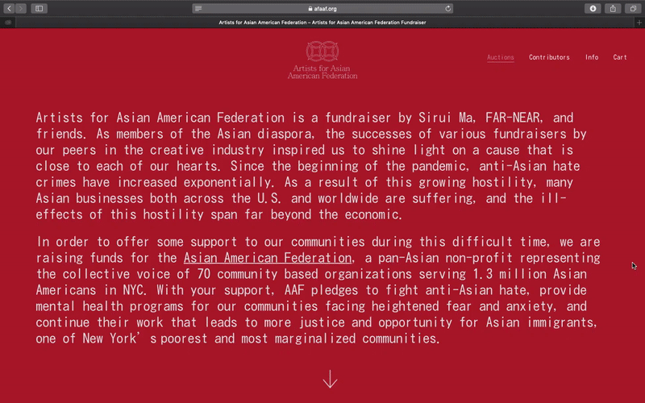
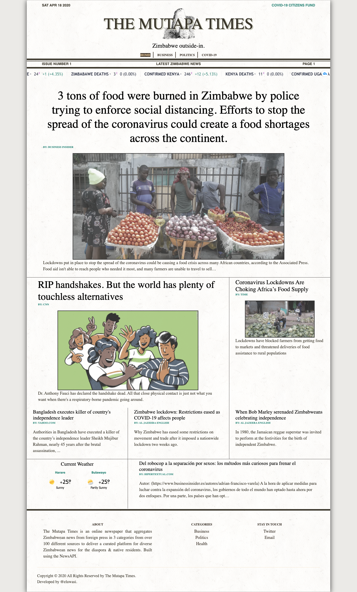
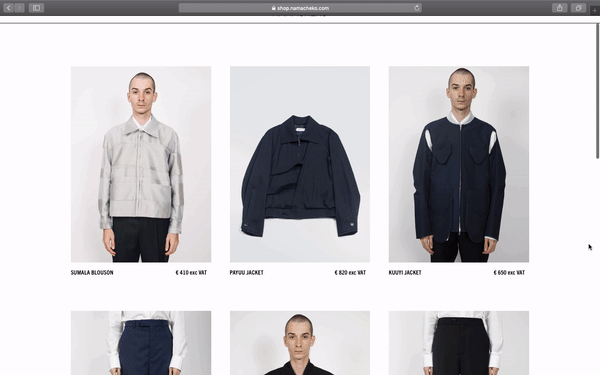
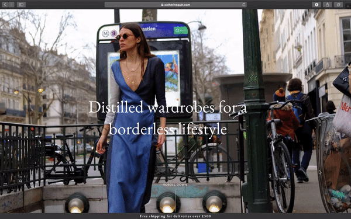
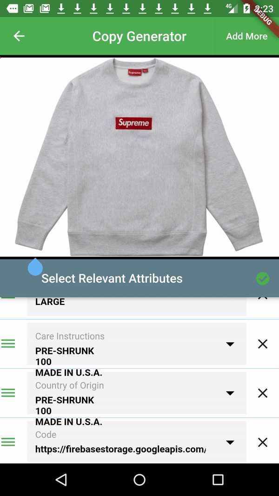

## Artists for the Asian American Federation (Auction Website) 

<a href="https://afaaf.org"><h4>Preview</h4></a>

Artists for the Asian American Federation was online fundraiser by Sirui Ma, FAR-NEAR, and friends. The initiative raised funds for the Asian American Federation, a pan-Asian non-profit representing the collective voice of 70 community based organizations serving 1.3 million Asian Americans in NYC. Over a 6 week period over 300 orders placed & 500+ auction bids.  

##### status: complete, auctions ended
Link: https://afaaf.org

- full custom website design and development
- ecommerce development including auction bid system intergrated with outbid email notification features
- global stock locations 
  
## The Mutapa Times (Website) 

<a href="https://mutapatimes.com"><h4>Preview</h4></a>

The Mutapa Times is an online newspaper that aggregates Zimbabwean news from foreign press in 3 categories from over 100 different sources to deliver a curated platform for diverse Zimbabwean news for the diaspora & native residents.  

status: change in API access and restrictions led to site closing dowmn :( 
Link: https://mutapatimes.com

- website design and development
- dynamic content from the NewsAPI
- twitter bot
  

## NAMACHEKO AW20 Paris Fashion Week Show Live Stream (Livestream) 

<a href="https://shop.namacheko.com/stream"><h4>Preview</h4></a>

status: complete

Directed the global multi-platform & dual-camera live stream of Namacheko AW20 paris fashion week which featured a collaboration with Gregory Crewdson. The livestream was promoted by Gagosian gallery and Vogue(Global) across social media and websites. 

Link: https://namacheko.com/stream

- live stream direction 
- project management
- colour grading 
- global communication plan with live stream partners
- OBS broadcasting 
  
## Namacheko (Brand) 

<a href="https://shop.namacheko.com/"><h4>Preview</h4></a>

status: complete

Minimal website designed to suit high demand limited edition releases. 

Link: shop.namacheko.com

- web design 
- web development
- e-commerce strategy & development
- newsletter design and implementation 

## Ancestral Futures (Event) 

<a href="https://www.ancestralfutures.co.uk"><h4>Preview</h4></a>

status: complete

An event in London celebrating African ancestry through the eyes of four diaspora alternative artists. 

Link: https://www.ancestralfutures.co.uk

- visuals concept and direction 
- web design 
- event strategy & managemnt 
- web development 
- hologram design, 3D scan technician
- Sponsorship partnerships (4)

 

## Commodity Museum (Zine)

status: ongoing 
note: interested in contributing? [contact me](/contact) 

A research zine focused on exploring identity of African diaspora. First volume comes in the format of a fictional "Bantu Passport" in which partipants identify themselves not by their nationality but by their ethnic bantu group, language, ancestral home and birth place. 
Due for release Summer 2020. 

Link: https://commoditymuseum.com

- concept and art direction 

## Catherine Quin (Brand) 

<a href=""><h4>Preview</h4></a>

status: complete

Full custom e-commerce website designed for Catherine Quin's "suitcase" collections strategy.

Link: catherinequin.com

- web design 
- web development 
- e-commerce development 
- newsletter intergration 
- search engine optimisation 

## Doneight (App) 

<a href=""><h4>Preview</h4></a>

status: ongoing

E-Commerce app designed to enable charity shop volunteers to sort and upload donated items to an online shop within 2 minutes using machine-learning to detect product attributes and translate them to product copy which is deployed straight to the product page in 10 taps or less. 

Developed as part of my final year computing degree @ Goldsmiths University. If you want to see it please [shout me](eluwasi.com/contact).  

Need some dev help too, if you can help with that please [shout me](eluwasi.com/contact).

Link: doneight.com

- firebase database
- programmed in dart language using flutter
- shopify e-commerce
- app architecture on google cloud platform
- google cloud vision machine learning library 

## Shumba Maasai - AK Suttin (Music Video) 

<a href="https://notion.online/ak-suttin-by-shumba-maasai/"><h4>Preview</h4></a>

status: completed

A music video exploring my fascination with the thinning line that devides reality and simulation. 

Link: https://notion.online/ak-suttin-by-shumba-maasai/

- music video concept 
- direction
- editing

## Namacheko x Daniel Libeskind for London Festival of Architecture (installation)  

status: complete 

Worked with Namacheko, LFA and aclaimed architect Daniel Libeskind to create an installation in Dover Street Market London's event space. 

Link: https://highsnobiety.jp/p/namacheko-dover-street-market/

- concept 
- project management 
- procurement 
  
## BEATSXEE25 - Nick Knight (Fashion Film)

status: complete

Beats collaborated with Nick Knight and SHOWstudio to present The Seven Deadly Sins of Edward Enninful, a film honouring 25 years of fashion by the acclaimed stylist.  It stars Mariacarla Boscono, Naomi Campbell, Jourdan Dunn, Karen Elson, Anna Ewers, Karlie Kloss, Kate Moss and Lara Stone and narrated by Travis Scott.

Link: https://www.showstudio.com/projects/beatsxEE25

- 3D scan technician 
  
## White-Crayon (Design Agency) 

We development for London based creative agency white-crayon. The website features a white crayon cursor when overig of a black board which can be used to draw sketches in real time. Background colours alternate upon hover to to reflect the concept of the white-crayon. 

Link: http://white-crayon.com

- web devolpment in html, css & javascript
## Ach-Jo (Brand) 

status: complete

Collection marketing static website for Central Saint Martins Fashion design graduate Domika Kadadova. 

Link: ach-jo.com

- web design 
- web development 

## Ezra Lloyd Jackson  (Graphic Designer) 

Static web development for graphic designer and aroma jockey Ezra Jackson. 

Link: ezralloydjackson.com

- web devolpment 

## Shumba Maasai - AK Suttin (Game) 

status: complete

With the release of Shumba Maasai's song AK Suttin i built a toungue in cheek space invaders inspired game.The game sees Shumba as the main character in a galaxy of bad emojis in which he shoots out positivity bullets. The game was part of a marketing strategy to capture more emails for the artist's newsletter. 

Link: http://ak-suttin.shumbamaasai.com

- game development in javascript
- P5 JavaScript library
- artistic Direction 
  

## South by NorthWest (Radio Show) 

status: complete

Weekly radio show playing music from North and West Africa back to back with music from Southern Africa. 
General idea was to introduce people to music from Southern Africa infused with popular afrobeat and afro-fusion from West Africa. 

Link: https://wiredradio.co.uk

- radio host 
- mixing 
